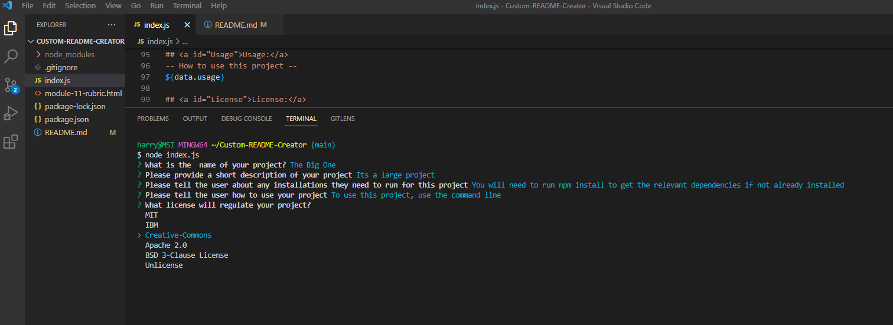

# Custom Node.js README Creator
## Description 
This is a node.js command-line application that generates a README file based on user input using the Inquirer.js library for prompting the user with questions. The user is asked to provide information such as project title, description, installation requirments, usage instructions, license type, contribution guidelines, test instructions, and contact information. 

The application then takes this input and generates a README.md file with the provided information, including a badge at the top of the page visually displaying the chosen license type. 

The file is created using the fs library and the content is formatted using markdown syntax. This tool can save time and ensure consistency in generating README files for projects. 
### How to use this program 

* You will need to have Node.js installed on your computer. Once Node.js is installed, you can clone or download the project files from this repository hosting platform like GitHub. 

* After that, open the terminal or command prompt and navigate to the project directory. 

* If neccessary, run  'npm install' to install neccessary dependencies. 

* Finally, run the command node index.js to start the application, which will then prompt you with a series of questions.

### What I have learnt 

* How to use Node.js and npm to install and manage packages and run Javascript outside fo a browser
* How to use the Inquirer.js package to create a CLI that prompts users for input and stores the responses in an object
* How to use string interpolation to dynamically generate text and embed variables in a string in JavaScript
* Deepened my understanding of structuring a professional README.md file
## Credits 

* https://www.w3schools.com/js/js_arrow_function.asp
* https://www.npmjs.com/package/inquirer#questions
* https://coding-boot-camp.github.io/full-stack/github/professional-readme-guide

